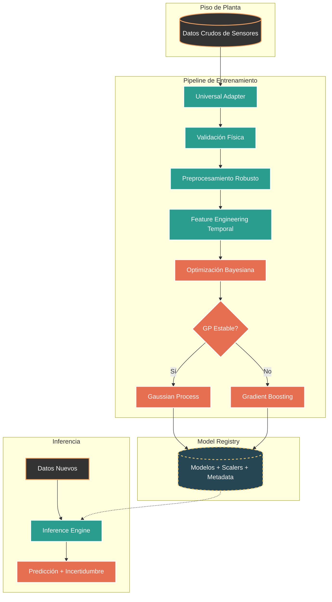

# 🛰️ Universal Soft-Sensor

## Pipeline ETL + Soft-Sensor industrial con Gaussian Processes — agnóstico al dominio

<div align="center">


**Soft-Sensor predictivo con incertidumbre calibrada para cualquier proceso industrial con sensores**

</div>

---

## 📋 Resumen

Pipeline **agnóstico al dominio** que reemplaza mediciones lentas o costosas (análisis de laboratorio, inspecciones) mediante un **Soft-Sensor basado en IA**: predice variables críticas del proceso en tiempo casi real a partir de los datos de sensores existentes, con intervalos de confianza calibrados.

**No está atado a ninguna industria.** El schema de validación física detecta la categoría de cada sensor por el nombre de la columna (coincidencia por subcadena, no regex — decisión deliberada: sin exposición a ReDoS), así que el mismo pipeline funciona con cualquier dataset de sensores cambiando solo la configuración (`config/dataset_config.json`):

| Dominio probado | Dataset | Qué predice |
|---|---|---|
| ⚒️ Flotación minera (caso de origen) | Quality Prediction in a Mining Process (Kaggle) | % sílica / % hierro en concentrado |
| ⚙️ Mantenimiento de máquinas rotativas | AI4I 2020 (UCI) | Fallo de máquina (torque, rpm, tool wear, TWF/HDF/PWF/OSF) |
| 🧩 Cualquier otro | Tu CSV con nombres de columna descriptivos | Lo que declares como `target_column` |

La arquitectura combina:

* **Procesos Gaussianos (GP)** para modelar precisión e incertidumbre calibrada.
* **Gradient Boosting** como fallback automático frente a ruido o no-estacionariedad.
* **Pipeline ETL** con validación física universal por pattern matching.
* **Dashboard HMI** con inferencia reactiva y motor What-If.

Preparado para integrarse con historiadores industriales (SCADA, PI System) y estrategias de Advanced Process Control (APC).

> 📛 **Historia del nombre:** este proyecto nació como "Proyecto Minero 4.0" (su primer caso de uso fue flotación minera). Se renombró a **Universal Soft-Sensor** cuando el mismo pipeline, sin cambios de código, demostró funcionar en mantenimiento predictivo de máquinas rotativas. Los defaults de flotación se conservan por retrocompatibilidad.

---

## 🎯 Capacidades del Sistema

* Predicción de variables críticas del proceso (recovery, grade, silica, etc.)
* Cuantificación de incertidumbre con intervalos de confianza calibrados
* Diagnóstico automático de autocorrelación temporal
* Detección y eliminación de data leakage por configuración declarativa (JSON)
* Validación física universal: detecta categoría de cada sensor por nombre
* Generación automática de reportes de auditoría (PDF)
* Motor What-If para simulación de escenarios operativos

**Métricas objetivo:**
* R² ≥ 0.95
* MAPE < 2%

---

## 🏗️ Arquitectura



---

## ✨ Características de Ingeniería

* **Ingesta Universal**: Auto-detección de separador, encoding, formatos de fecha. Filtrado de columnas por coincidencia de subcadena declarativa (substring, no regex — evita ReDoS).

* **Schema de Validación Física v2.0**: Pattern matching universal que detecta categoría (temperatura, porcentaje, flujo, pH, nivel, etc.) por nombre de columna. Soporta gold_recovery, AI4I2020, y cualquier dataset con nombres descriptivos.

* **Modelado Híbrido**: GP con kernels Matérn optimizados vía Optuna. Fallback automático a GradientBoosting si R² < 0.6.

* **Conciencia Temporal**: Sin shuffle, lags configurables, ventanas móviles, diagnóstico de autocorrelación con auto-ajuste de subsample.

* **Dashboard HMI**: Streamlit con refresco por fragmentos, motor What-If para perturbación de variables, y visualización Plotly.

---

## 🚀 Instalación

```bash
git clone https://github.com/CienciaEstelar/universal-soft-sensor.git   # (repo GitHub: renombrar desde proyecto_minero_4.0)
cd universal-soft-sensor
python -m venv .venv
source .venv/bin/activate
pip install -r requirements.txt
```

---

## ⚙️ Configuración

1. Coloca tu archivo CSV de sensores en `data/`.
2. Copia `config/dataset_config.example.json` a `config/dataset_config.json`.
3. Edita el JSON para definir tu dataset, target, y reglas de filtrado.
4. (Opcional) Copia `.env.example` a `.env` para parámetros avanzados.

---

## 🎮 Uso

### Escaneo de estructura
```bash
python -m tools.scan_schema
```

### Pipeline ETL
```bash
python -m core.pipeline
```

### Entrenamiento
```bash
python train_universal.py
```

### Inferencia
```bash
python predict_universal.py
```

### Dashboard
```bash
streamlit run dashboard.py
```

---

## 📂 Estructura

```text
universal-soft-sensor/
├── config/                  # Configuración centralizada
│   ├── settings.py          # Single Source of Truth
│   └── dataset_config.json  # Reglas de ingesta (personalizar)
├── core/                    # Núcleo del sistema
│   ├── adapters/            # Ingesta universal de datos
│   ├── models/              # GP + GradientBoosting
│   ├── validation/          # Schema físico + Validador
│   ├── preprocessor.py      # Limpieza estadística
│   ├── pipeline.py          # Orquestador ETL
│   ├── inference_engine.py  # Motor de producción
│   └── report_generator.py  # Auditoría PDF
├── tools/                   # Utilidades de diagnóstico
├── tests/                   # Tests unitarios + integración
├── dashboard.py             # HMI Streamlit
├── train_universal.py       # Orquestador de entrenamiento
├── predict_universal.py     # Simulador de inferencia
└── requirements.txt
```

---

## 🧪 Testing

```bash
pip install -e ".[dev]"
pytest tests/ -v
```

---

## 📄 Licencia

**AGPL-3.0** — Puedes ver, estudiar y modificar el código. Si lo usas en un servicio o producto, debes publicar tus modificaciones bajo la misma licencia. Para uso comercial privado, contactar al autor.

---

<div align="center">

**Soft-sensor universal — nacido en Minería 4.0, probado en mantenimiento predictivo**
Juan Galaz — Ingeniería de Ejecución en Minas (USACH)

</div>
